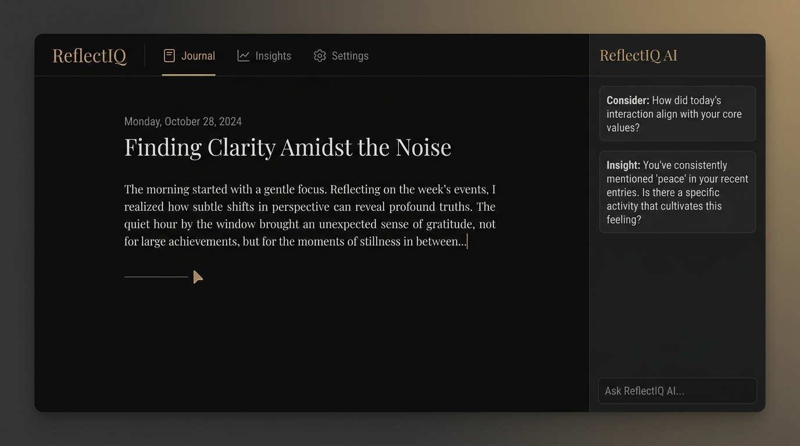
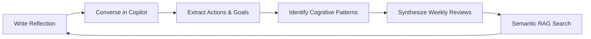
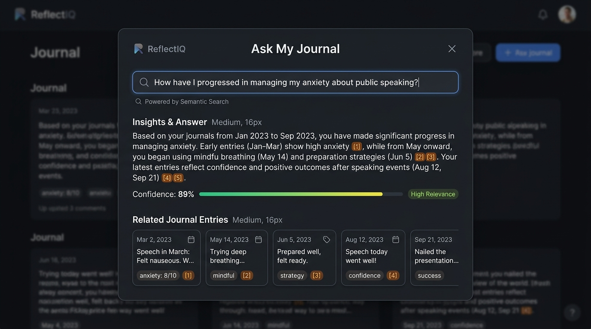

# ReflectIQ — Personal Reflection Intelligence Platform

<p align="center">
  
</p>

<p align="center">
  <strong>A distraction-free, privacy-first personal reflection intelligence platform powered by Google Gemini and Cloud Run.</strong><br>
  <em>Designed as a deliberate thinking surface rather than a transactional chatbot.</em>
</p>

<p align="center">
  <a href="#visual-showcase"></a>
  <a href="#visual-showcase"></a>
  <a href="#visual-showcase"></a>
  <a href="#deployment--setup-on-google-cloud-run"></a>
  <a href="#cloud-firestore-security-rules"></a>
  <a href="#security--threat-model-countermeasures"></a>
</p>

---

## Overview

**ReflectIQ** transforms personal journaling into an active cognitive mirror. Rather than functioning as a generic AI chat window, ReflectIQ provides an editorial writing desk coupled with a docked, context-aware AI reflection partner grounded exclusively in the user's active journal entry.

Over days and weeks of journaling, ReflectIQ autonomously identifies recurring thinking patterns, cognitive shifts, unstated blockers, and progress toward goals, culminating in structured weekly reviews and semantic vector search across your lifetime reflection history.

### The Continuous Reflection Cycle



---

## Visual Showcase

### 1. Minimalist Writing Desk & Context-Grounded Copilot
The central reflection workspace features clean typography, distraction-free markdown authoring, auto-saving indicators, and an interactive assistant sidebar that operates strictly on the active entry.


### 2. Cognitive Patterns & Trend Analysis
ReflectIQ analyzes long-form entries over time to notice cognitive shifts, recurrent friction points, and emergent strengths — presented as gentle hypotheses to consider, never clinical diagnoses.


### 3. "Ask My Journal" Grounded Semantic Search (RAG)
Users can ask natural language questions about their personal history (*"When did I feel most energized at work?"* or *"What did I learn from the project launch?"*). ReflectIQ performs vector similarity search across entries, grounding responses with exact citations and confidence ratings.



---

## Core Capabilities

| Feature | Description | Gemini Mode / SDK |
|---|---|---|
| **Multi-Mode Copilot** | Specialized reflective dialogues: *Reflect*, *Brainstorm*, *Plan*, *Review*, and *Problem Solve*. Never acts as a passive chatbot. | `@google/genai` (Server-Side) |
| **Resilient Fallback Ladder** | Multi-tier model failover ladder (`gemini-3.6-flash` &rarr; `gemini-3.1-flash-lite` &rarr; `gemini-flash-latest` &rarr; `gemini-3.7-flash`). | Resilient Fallback Protocol |
| **Professional Error Framing** | Raw API exceptions, quota limits, and 429 status codes are transformed into calm, respectful notices reassuring that personal notes are preserved. | `lib/error-handling.ts` |
| **Grounded Semantic RAG** | Vector embeddings (`gemini-embedding-2-preview`) computed per reflection with cosine similarity matching and source attribution badges. | Retrieval-Augmented Generation |
| **Autonomous Pattern Engine** | Synthesizes recurring threads, emotional shifts, and blockers across historical journal entries. | Structured JSON Schema |
| **Weekly Review Synthesizer** | Aggregates reflections, goal milestones, and friction points into structured weekly retrospectives. | Weekly Retro Synthesis |
| **User-Governed Memory** | Memories and context extracted by the assistant require explicit user confirmation before persisting to Firestore. | Explicit Memory Governance |
| **Action & Goal Alignment** | Detects implied commitments in writing and suggests concrete, time-bound next steps. | Bidirectional Goal Tracking |

---

## Professional Error Framing & Resilience

In production applications, exposing raw API exceptions (such as `RESOURCE_EXHAUSTED`, `429 Too Many Requests`, or stack traces) damages trust and distracts users during sensitive personal writing sessions.

ReflectIQ implements a unified, layered error framing architecture:

1. **Server-Side Normalization (`lib/server/gemini.ts` & `lib/server/security.ts`)**:
   - Catches quota limits, capacity spikes, and transient timeouts.
   - Throws structured `AIServiceError` instances with normalized codes (`CAPACITY_REACHED`, `TEMPORARILY_UNAVAILABLE`).
   - Diagnostic errors are logged exclusively to server logs (`[API_ERROR_DIAGNOSTIC]`) for Cloud Logging observability.
2. **Client-Side Sanitization (`lib/error-handling.ts`)**:
   - Intercepts any technical strings or network failures.
   - Converts harsh alarms into reassuring, editorial notices (*"Assistant Temporarily at Capacity — Your thoughts and notes have been securely saved."*).
3. **Dedicated UI Component (`components/ui/ProfessionalNotice.tsx`)**:
   - Minimalist card with editorial bronze accents (`#A68E6A`) and obsidian tones (`#141414`).
   - Displays a prominent **"Writings Safe"** badge so the user never fears data loss.
   - Includes seamless retry and dismiss actions without reloading the page.

---

## Security & Threat Model Countermeasures

ReflectIQ enforces defense-in-depth compliant with the **OWASP Top 10 for Web** and **OWASP Top 10 for Large Language Model Applications**:

| Threat Zone | Specific Risk | ReflectIQ Countermeasure & Mitigation |
|---|---|---|
| **Input Surfaces** (OWASP A03 / LLM02) | Malicious prompt injection or malicious text payloads. | Strict sanitization via `sanitizeInput()`, HTML entity escaping, and invisible Unicode character stripping before ingestion. |
| **Planning & Reasoning** (OWASP LLM01) | Jailbreaking or bypassing non-clinical therapy boundaries. | Robust system instructions explicitly prohibiting clinical/diagnostic authority. Gemini explicitly prompts the user to seek certified healthcare professionals if medical distress is detected. |
| **Tool & Route Execution** (OWASP A01) | Broken access control or unauthorized tenant data access. | Cryptographic verification of Firebase Auth JWTs on every server endpoint (`verifyAuthToken()`). No client-submitted UID is ever trusted. |
| **Memory & State** (OWASP A01 / A05) | Cross-user reflection leaks or unauthorized read/write. | Strictly owner-bound Firestore security rules (`request.auth.uid == userId`). All collections are subcollections of `/users/{userId}/*`. |
| **Inter-System Communication** (OWASP A02) | API Key leakage or hardcoded secrets. | Zero hardcoded credentials. All Gemini API access is proxied server-side via Google Cloud Secret Manager (`GEMINI_API_KEY`). |
| **Denial of Service & Abuse** (OWASP A04) | Rapid automated prompt submission exhausting API quotas. | Sliding-window per-UID rate limiting (30 intensive queries per 60-second window) with standard `Retry-After` HTTP 429 responses. |

---

## Cloud Firestore Security Rules

Deploy these rules to ensure absolute user data isolation:

```javascript
rules_version = '2';
service cloud.firestore {
  match /databases/{database}/documents {
    // Root level collections default deny
    match /{document=**} {
      allow read, write: if false;
    }

    // Isolated per-user document tree
    match /users/{userId} {
      allow read, write: if request.auth != null && request.auth.uid == userId;

      match /journals/{journalId} {
        allow read, write: if request.auth != null && request.auth.uid == userId;

        match /messages/{messageId} {
          allow read, write: if request.auth != null && request.auth.uid == userId;
        }
      }

      match /vectors/{vectorId} {
        allow read, write: if request.auth != null && request.auth.uid == userId;
      }

      match /insights/{insightId} {
        allow read, write: if request.auth != null && request.auth.uid == userId;
      }

      match /goals/{goalId} {
        allow read, write: if request.auth != null && request.auth.uid == userId;
      }

      match /actions/{actionId} {
        allow read, write: if request.auth != null && request.auth.uid == userId;
      }

      match /memories/{memoryId} {
        allow read, write: if request.auth != null && request.auth.uid == userId;
      }

      match /reviews/{reviewId} {
        allow read, write: if request.auth != null && request.auth.uid == userId;
      }
    }
  }
}
```

---

## Deployment & Setup on Google Cloud Run

### 1. Prerequisites & API Activation

Install the [Google Cloud SDK](https://cloud.google.com/sdk/docs/install) (`gcloud`) and authenticate with your project:

```bash
gcloud auth login
gcloud config set project YOUR_PROJECT_ID

# Enable required Google Cloud APIs
gcloud services enable \
  run.googleapis.com \
  secretmanager.googleapis.com \
  firestore.googleapis.com \
  cloudbuild.googleapis.com
```

### 2. Secret Manager Configuration

Store your Gemini API key in Google Cloud Secret Manager and grant the Cloud Run runtime service account permission to access it:

```bash
# Create and populate the secret
gcloud secrets create GEMINI_API_KEY --replication-policy="automatic"
echo -n "YOUR_GEMINI_API_KEY" | gcloud secrets versions add GEMINI_API_KEY --data-file=-

# Retrieve your project number
PROJECT_NUMBER=$(gcloud projects describe YOUR_PROJECT_ID --format='value(projectNumber)')

# Grant the default Cloud Run compute service account access to read the secret
gcloud secrets add-iam-policy-binding GEMINI_API_KEY \
  --member="serviceAccount:${PROJECT_NUMBER}-compute@developer.gserviceaccount.com" \
  --role="roles/secretmanager.secretAccessor"
```

### 3. Deploy to Cloud Run

Deploy the container directly from the root directory, mounting `GEMINI_API_KEY` from Secret Manager:

```bash
gcloud run deploy reflectiq \
  --source . \
  --region us-central1 \
  --platform managed \
  --allow-unauthenticated \
  --set-secrets GEMINI_API_KEY=GEMINI_API_KEY:latest \
  --set-env-vars NEXT_TELEMETRY_DISABLED=1
```

### 4. Required Campaign Labeling

Apply the mandatory resource label to register the service for automated verification:

```bash
gcloud run services update reflectiq \
  --update-labels=dev-tutorial=cloud-run-ai-challenge \
  --region=us-central1
```

---

## Local Development

### 1. Clone & Install Dependencies

```bash
git clone https://github.com/your-username/reflectiq.git
cd reflectiq
npm install
```

### 2. Configure Environment Variables

Create a `.env.local` file from the provided `.env.example`:

```bash
cp .env.example .env.local
```

Populate the required values:

```env
# Server-only Gemini API Secret (never prefix with NEXT_PUBLIC_)
GEMINI_API_KEY=your_gemini_api_key_here

# Firebase Client Configuration
NEXT_PUBLIC_FIREBASE_API_KEY=your_firebase_api_key
NEXT_PUBLIC_FIREBASE_AUTH_DOMAIN=your_project.firebaseapp.com
NEXT_PUBLIC_FIREBASE_PROJECT_ID=your_project_id
NEXT_PUBLIC_FIREBASE_STORAGE_BUCKET=your_project.appspot.com
NEXT_PUBLIC_FIREBASE_MESSAGING_SENDER_ID=your_sender_id
NEXT_PUBLIC_FIREBASE_APP_ID=your_app_id
```

### 3. Start Development Server

```bash
npm run dev
```

Open [http://localhost:3000](http://localhost:3000) in your browser.

---

## Verification & Interactive Walkthrough Test Suite

To verify all functional capabilities of ReflectIQ, follow this test matrix:

| Test Case | Interaction Steps | Expected Outcome |
|---|---|---|
| **1. Reflection Authoring & Persistence** | 1. Navigate to the Journal desk.<br>2. Type a reflection title and content.<br>3. Pause typing for 1.2s. | Title and content persist to Firestore; save status transitions from `Saving...` to `Saved`. |
| **2. Grounded Copilot Inquiry** | 1. Open the Assistant sidebar.<br>2. Select the `Reflect` mode.<br>3. Send a question about your active entry. | Gemini analyzes the active reflection and responds with grounded, non-clinical exploratory questions. |
| **3. Memory & Action Extraction** | 1. Write an entry mentioning a key commitment (*"I will email Jordan tomorrow"*).<br>2. Send a `Plan` prompt in Copilot. | The Copilot detects the proposed action and memory pill with `+ Add` button. Clicking adds it to your database. |
| **4. Cognitive Pattern Discovery** | 1. Navigate to **Patterns & Trends**.<br>2. Click **Look for patterns**. | The engine reads your historical entries and surfaces recurring cognitive shifts and thematic patterns. |
| **5. Grounded Semantic Search (RAG)** | 1. Click **Ask My Journal** in the top bar.<br>2. Enter a query (e.g., *"What did I learn about focus?"*).<br>3. Click **Ask**. | RAG retrieves the most relevant entries via cosine similarity and synthesizes a grounded answer with source badges. |
| **6. Professional Error Framing** | 1. Disconnect network or trigger high-frequency requests.<br>2. Send an inquiry. | A warm, editorial notice appears reassuring that notes are saved, with a retry button and no raw stack traces or quota alarms. |

---

## License

This project is licensed under the MIT License — see the [LICENSE](LICENSE) file for details.
